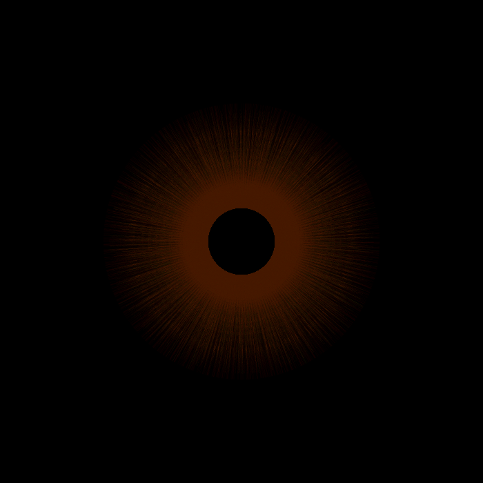

# sonic-iris
Turn a song into an iris using FFT.

Sonic Iris is a Processing visualization that transforms an audio signal into a
circular, eye-like spectrum.

The visualization analyzes the audio using FFT and progressively draws radial
frequency information around a circle. The angular displacement uses the golden
ratio to produce a visually distributed and non-repetitive pattern.



## Features

- WAV and MP3 audio input
- FFT-based audio analysis
- Circular / radial visualization
- Golden-ratio angular distribution
- Automatic output filenames based on the selected song
- PNG image export
- Audio file selection through a file dialog
- Processing 4 compatible

## How it works

The audio is divided into FFT windows.

Each FFT window produces one radial line:

    Audio
       |
       v
    FFT window
       |
       v
    Frequency spectrum
       |
       v
    Radial line
       |
       v
    Next angle

The angular step is based on the golden ratio:

```java
float angleStep = TWO_PI * 0.61803398875;
```

This avoids the strong visual repetition produced by simple angular increments.

## Requirements:

- Processing 3
- Minim library
- Video Export library
    
### Installing Minim

Minim is included with Processing in many installations. If it is not available,
install it through:

    Sketch → Import Library → Add Library...

Search for:

    Minim
### Installing Video Export

Install:

    Sketch → Import Library → Add Library...

Search for:

    Video Export
## Usage:

1. Open EyeSpectrum.pde in Processing 3.
2. Run the sketch.
3. Select an audio file when prompted.
4. The visualization will start automatically.
5. The generated files will be saved in the Processing sketch directory.

For example:

    song.mp3

produces:

    song_eye_spectrum.png

## Audio files

The audio file does not need to be included in the repository.

The sketch opens a file-selection dialog, so you can select any compatible
audio file from your computer.

Do not upload copyrighted music to this repository unless you have permission
to redistribute it.

## Output

The generated image has the same dimensions as the Processing sketch.


## Customization

The main parameters can be modified near the beginning of the sketch.

### FFT size

    int fftSize = 2048;

Larger values provide greater frequency resolution but fewer FFT windows per
second.

### Circle radius
    
    float r = 200;
    
### Angular step

    float angleStep = TWO_PI * 0.61803398875;

The current value uses the inverse of the golden ratio.

## License

This project is licensed under the [MIT License](LICENSE).

See LICENSE for details.

## Third-party libraries

This project uses third-party libraries:

- Minim — audio playback and FFT analysis
- Video Export — MP4 video export

These libraries are distributed under their respective licenses.

Please refer to their official repositories/documentation for licensing
information.

## Author

Created by [Ricardo Villagómez](https://github.com/rivies93).

## Contributing

Suggestions, improvements and pull requests are welcome.

If you find a bug, please open an issue with:

- Processing version
- Operating system
- Audio format
- FFT size
- Error message
